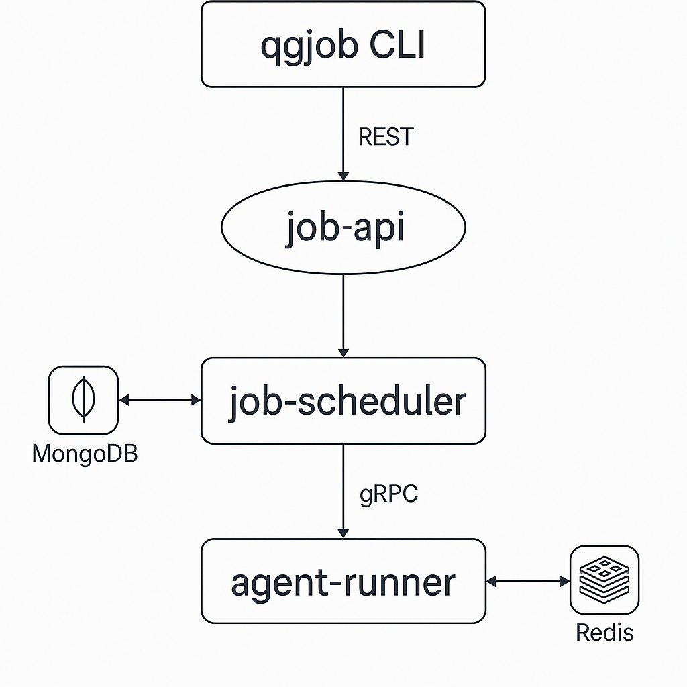

# Test Orchestration Platform 🚀

A scalable, production-ready test orchestration platform built with NestJS microservices architecture. This platform enables automated testing across multiple environments including emulators, physical devices, and cloud services like BrowserStack.

## 🏗️ Architecture Overview


The platform consists of three main microservices:

- **job-api**: REST API service for job submission and management
- **job-scheduler**: gRPC-powered service for job queuing and scheduling
- **agent-runner**: Job execution service with simulated test runners

### Key Features

- ✅ **Microservices Architecture**: Scalable, maintainable service separation
- ✅ **Job Grouping**: Intelligent batching by app version for efficiency
- ✅ **Priority Queuing**: BullMQ-powered job prioritization and retry logic
- ✅ **Multi-Environment Support**: Emulator, device, and BrowserStack targets
- ✅ **CLI Tool**: Developer-friendly command-line interface
- ✅ **CI/CD Integration**: GitHub Actions workflow automation
- ✅ **Production Ready**: Docker containerization and health checks

## 🚀 Quick Start

### Prerequisites

- Node.js 20+
- Docker & Docker Compose
- Git

### 1. Clone and Setup

```bash
git clone <repository-url>
cd test-orchestration-platform
cp .env.example .env
```

## 🛠️ Development

### Running Services Locally

```bash
# Use specified node version
nvm use

# Install dependencies
npm install

# Start MongoDB and Redis
docker-compose up -d mongodb redis

# Start services in development mode
npm run dev:job-api
npm run dev:job-scheduler
npm run dev:agent-runner

```

### 2. Start Infrastructure (Using docker)

```bash
# Start all services
docker-compose up --build -d

# Check service health
docker-compose ps
```

### 3. Install CLI Tool

```bash
npm run build
npm link
```

### 4. Submit Your First Job

```bash
# Submit a test job
qgjob submit \
  --org-id "qualgent" \
  --app-version-id "v1.0.0" \
  --test "tests/smoke.spec.ts" \
  --target "emulator" \
  --priority 8

# Check job status
qgjob status --job-id <job-id>

# Poll until completion
qgjob poll --job-id <job-id> --interval 5
```

### CLI Configuration

```bash
# Configure API endpoint
qgjob config --api-url http://localhost:3001

# Set default priority
qgjob config --default-priority 7

# Set default environment
qgjob config --default-environment emulator
```

## 📋 API Reference

### Submit Job
```bash
POST /jobs/submit
{
   "org_id": "qualgent",
   "app_version_id": "v1.0.0",
   "test_path": "tests/onboarding.spec.ts",
   "target": "emulator",
   "priority": 8,
   "tags": ["ci", "smoke"],
   "metadata": {"branch": "main"}
}

```

### Get Job Status
```bash
GET /jobs/status?jobId=<job-id>
```

### Get Jobs by Group
```bash
GET /jobs/group/<app-version-id>?limit=10&offset=0
```

### Get Statistics
```bash
GET /jobs/stats
```

## 🔄 CI/CD Integration

### GitHub Actions

The platform includes a complete GitHub Actions workflow that:

1. **Starts Infrastructure**: MongoDB, Redis services
2. **Builds Services**: Compiles TypeScript, runs tests
3. **Submits Test Jobs**: Multiple environment targets
4. **Polls for Completion**: Waits for job results
5. **Reports Results**: Success/failure with detailed logs

### Example Workflow Usage

```yaml
- name: Run Test Orchestration
  run: |
    qgjob submit \
          --org-id "qualgent" \
          --app-version-id "v1.2.3-${GITHUB_SHA:0:7}" \
          --test "tests/emulator.spec.ts" \
          --target "emulator" \
          --priority 8
```

### Horizontal Scaling

```bash
# Scale API servers
docker-compose up -d --scale job-api=3

# Scale agent runners
docker-compose up -d --scale agent-runner=5
```

### Performance Optimizations

- **Database Indexing**: Optimized MongoDB indexes for queries
- **Connection Pooling**: Efficient database connection management
- **Queue Optimization**: BullMQ with Redis clustering support
- **Caching**: Redis-based caching for frequent queries

### Test Environments
- **Emulator**: Fast, isolated testing
- **Device**: Real device testing
- **BrowserStack**: Cross-platform cloud testing

## 📚 Advanced Features

### Job Deduplication
Prevents duplicate job submissions within configurable time windows.

### Retry Logic
Exponential backoff retry mechanism with configurable attempts.

### Audit Logging
Comprehensive logging for compliance and debugging.
